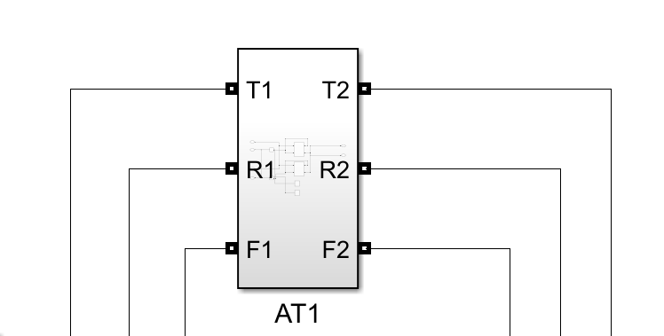

> 本文基于 Matlab 2023b，Simulink 10.4，Simscape 5.3 编写。

## 背景

最近学校的一门课程，大作业的任务是通过线路牵引供电模型计算铁路区间上正在行驶的列车所处的位置，其中用到了 Simscape，Matlab 本身对 Simulink 的支持很到位，文档也给的很全，但是对于 Simscape 的部分还是踩了许多坑，这里记录一下，这部分主要集中在文章的后半段；模型本身其实比较简单，所以以下的举例也不是很复杂，主要针对已有模型。

## 使用 Matlab 读取 Simulink 模型

Simulink 中的功能大多都可以通过 Matlab 程序实现，可以查看 [Simulink - Programmatic Modeling Basics](https://ww2.mathworks.cn/help/simulink/ug/approach-modeling-programmatically.html) ，这里总结一下，对已有模型，在 .m 语言中有以下几个函数可以对模型进行一些文件操作：

```matlab
% 打开模型
% 同时会打开 Simulink 的窗口，对比加载模型，同步性会更好
% 也不容易遇到文件锁的问题，这个问题在使用这行代码打开后可以通过关闭 Simulink 窗口解决
open_system('model_name');

% 加载模型
% 只会加载模型，不会打开 Simulink 窗口
% 但如果程序中间异常退出，没有进行到 close_system，会导致模型文件被锁定，无法再次打开，可能需要重启 Matlab
load_system('model_name');

% 保存模型
% 保存模型的当前状态，包括参数设置等
% 可以设置 ('OverwriteIfChangedOnDisk',true) 来响应文件系统变更
save_system('model_name');

% 关闭模型
close_system('model_name');
```

## 使用 Matlab 编辑 Simulink 模型

首先，在 Simulink 内部，模型的不同组件使用的是像 Linux 文件系统一样的路径来进行标识，例如：

```matlab
% 这里的 SubsystemName 和 BlockName 都是模块的名字（如下图模块的名字就是 AT1）
block_name = 'model_name/BlockName'
block_name1 = 'model_name/SubsystemName/BlockName'
block_name2 = 'model_name/SubsystemName/SubsystemName/BlockName'
```



### 关于 Simulink 模块

可以使用以下几个命令读取或者设置模块的参数：

```matlab
% 获取模块参数
get_param(block_name,'parameter_name')
% 例如：获取模块句柄 (Handle)
% 通过句柄可以对模块进行操作
get_param('model_name/BlockName','Handle')

% 设置模块参数
set_param(block_name,'parameter_name','value')
% 例如：设置模块位置
set_param('model_name/BlockName','Position',[100,100,200,200])
```

Matlab 中提供了两个函数可以对模块进行增删：

```matlab
% 添加模块
add_block('block_type','model_name/BlockName')
% 这个函数也可以用于模块的复制
add_block('model_name/Subsystem1/BlockName','model_name/Subsystem2/BlockName')
% 例如：添加一个 Gain 模块
add_block('simulink/Commonly Used Blocks/Gain','model_name/BlockName')

% 删除模块
delete_block('model_name/SubsystemName/BlockName')
% 例如：删除一个 Gain 模块
delete_block('model_name/BlockName')
```

__Matlab 没有提供模块的移动（剪切）的函数__，这个可以通过以下方法实现（踩的坑之一）：

```matlab
% 复制模块
add_block('model_name/Subsystem1/BlockName','model_name/Subsystem2/BlockName')
% 删除原模块
delete_block('model_name/Subsystem1/BlockName')
```

### 关于模块的连接

对于 Simscape 模块，建议使用模块的端口句柄来建立连接线，例如：

```matlab
% 获取端口句柄(实际上是一个包含端口ID的列表)
Block_PortHandle = get_param('model_name/BlockName','PortHandles')
```
__注意__ 大部分 Simscape 电器模块的端口是双向的，所以 __不__ 需要指定端口的方向（即不能使用句柄中的`Inport`和`Outport`，而是使用`LConn`和`RConn`，这两个属性并不区分方向，只是指示端口在模块的左侧还是右侧），这和 Simulink 中的一般模块不同，但 Simscape 模块之间的连接线在程序索引时依然 __区分__ 方向，在这一小节结尾会讨论这件事

模块的连接可以通过以下几个函数实现：

```matlab
% 添加连接线
add_line('model_name/Subsystem','BlockName1/Port','BlockName2/Port')
% 使用句柄
add_line('model_name/Subsystem',Block1_PortHandle.PortName,Block2_PortHandle.PortName)
% 例如：连接两个模块
add_line('model_name/Subsystem','Block1/LConn1','Block2/RConn4')
add_line('model_name/Subsystem',Block1_PortHandle.LConn(1),Block2_PortHandle.RConn(4))
% 如果句柄中端口数量一样，可以进行批量连接
add_line('model_name/Subsystem',Block1_PortHandle.LConn,Block2_PortHandle.RConn)

% 删除连接线
delete_line('model_name/Subsystem','BlockName1/PortName','BlockName2/PortName')
% 例如：删除两个模块的连接
delete_line('model_name/Subsystem','Block1/LConn3','Block/RConn5')
% 同理，可以使用句柄
delete_line('model_name/Subsystem',Block1_PortHandle.LConn(3),Block2_PortHandle.RConn(5))
```

这里也遇到了两个问题，首先，删除连接线时如果线路不存在，会报错，所以如果可能遇到重复删除的问题，建议套一个 `try catch`，例如：

```matlab
try
    delete_line('model_name/Subsystem',Block1_PortHandle.RConn(4),Block2_PortHandle.LConn(5))
catch
end
```

其次，如果连接线的两端模块不在同一个子系统中，会报错，可能需要移动模块，实现参考上一小节。

最后，关于 Simscape 模块间的连接线，虽然 Simscape 的电气端口不区分方向，但是其连接线仍像 Simulink 中的连接线一样区分方向，所以在进行删除操作时可能会遇到 __明明连接线存在，但是删除时报错的情况__ ，这大概率就是删除时端口的顺序反过来了，所以建议对每个连接线进行两次删除，因为一定会有一次冗余，所以这样操作一定要套上 `try catch` ，例如：

```matlab
try
    delete_line('model_name/Subsystem',Block1_PortHandle.RConn(4),Block2_PortHandle.LConn(5))
catch
end
try
    delete_line('model_name/Subsystem',Block2_PortHandle.LConn(5),Block1_PortHandle.RConn(4))
catch
end
```

以上这种情况更有可能发生在已有的手动建立的模型中，手动建立的连接线非常可能起始于不同的模块，但在程序建立连接线时，如果保证在函数中输入的端口顺序都一致的话就不会出现这种问题。

## 运行 Simulink 仿真

运行模型就比较简单了，只需要调用 `sim` 函数：

```matlab
% 直接运行仿真，关于 sim 函数的更多参数请查看文档
% https://ww2.mathworks.cn/help/simulink/slref/sim.html
out = sim('model_name');

% 或使用 set_param 方法调用 Simulink 的运行命令
set_param('model_name','SimulationCommand','start');
```

refs:

[Simulink - Programmatic Modeling Basics](https://ww2.mathworks.cn/help/simulink/ug/approach-modeling-programmatically.html)
